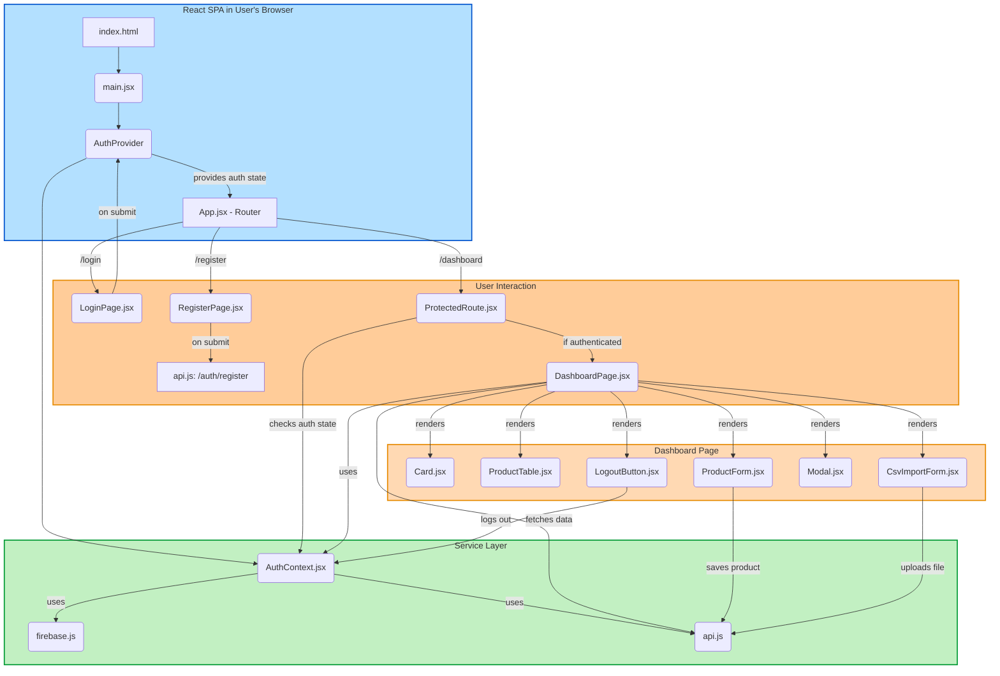

# MSME Inventory Lite - Frontend

## 📌 Project Overview

This is the **frontend client** for the MSME Inventory Lite application.  
It is a **Single Page Application (SPA)** designed to provide a user interface for the backend inventory management system.  
The application is responsive, functional, and user-friendly, focusing on core inventory management tasks.

---

## 🚀 Getting Started

Follow these steps to run the frontend client locally.

### **Prerequisites**

- **Node.js:** v20.0.0 or later  
- **npm:** Node Package Manager

---

### **Installation and Setup**

1. **Clone the repository:**

   ```bash
   git clone https://github.com/vivekjoshi56743/msme-inventory-client.git
   cd msme-inventory-client/client
   ```

2. **Install dependencies:**

   ```bash
   npm install
   ```

3. **Configure environment variables:**

   - Create a `.env` file in the root directory.
   - Add your Firebase configuration and backend API URL:

     ```env
     VITE_FIREBASE_API_KEY=your_api_key
     VITE_FIREBASE_AUTH_DOMAIN=your_auth_domain
     VITE_FIREBASE_PROJECT_ID=your_project_id
     VITE_FIREBASE_STORAGE_BUCKET=your_storage_bucket
     VITE_FIREBASE_MESSAGING_SENDER_ID=your_messaging_sender_id
     VITE_FIREBASE_APP_ID=your_app_id
     VITE_API_PROD_BASE_URL=http://localhost:8000
     ```

4. **Run the development server:**

   ```bash
   npm run dev
   ```

   The application will be accessible at the URL provided by Vite, typically [http://127.0.0.1:5173](http://127.0.0.1:5173).

---

## ✨ Features

- **User Authentication:**  
  Secure email/password login and registration using Firebase authentication. Protected routes ensure only authenticated users can access the dashboard.

- **Dashboard & KPIs:**  
  Displays key performance indicators such as total items, total stock value, and low stock count, fetched from a server-computed endpoint.

- **Product Management:**  
  Interface for creating, reading, updating, and deleting products. The `ProductForm.jsx` component dynamically disables the `unit_price` field for 'staff' users, implementing backend business logic.

- **Search and Filter:**  
  Dashboard includes a search input and category filter to help users find products quickly. Search uses a debounce hook to optimize API calls.

- **CSV Import:**  
  `CsvImportForm.jsx` allows users to upload a CSV file to bulk import products, displaying a summary of the import and any row-level errors.

- **Optimistic Concurrency Conflict:**  
  Handles `409 Conflict` errors from the backend. (A dedicated conflict resolution modal UI is not explicitly implemented.)

---

## 🧪 Test Artifacts

- **UI Test (Interaction):**  
  A unit test for the `ProductTable` component (`src/components/ProductTable.test.jsx`) verifies that product data is rendered correctly and that an appropriate message is shown when there are no products to display.

**Run frontend tests:**

```bash
npm run test
```

### Frontend Architecture Flow

